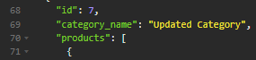

# E-Commerce-Hub

## Description 

This is an E-Commerce Backend Hub Application, this is a tool for companies to store relavant product information in a secure server that allows for categorical creation, updating, and deletion with ease. This application uses express routes and SQL methods in order to provide users with a seamless database that is both easy and effective when it comes to product organization and upkeeping.

## Mock-Up

### Here is a video link showing the usage of the application:
[E-Commerce Hub Video Demo](https://drive.google.com/file/d/14L3AyHbhvUEWOUyBVTyy0pmniRsqDGk_/view)

### The following is an example output of testing the get route of categories within insomnia for the E-Commerce Hub:


## Table of Contents

* [Installation](#installation)
* [Code Example](#code-example)
* [Usage](#usage)
* [Learning Points](#learning-points)
* [Author Info](#author-info)
* [Credits](#credits)
* [License](#license)

## Installation

1. Clone down the repository or download all files within repository
2. You will need to install node.js
3. You will need to edit the .env file to the database, user, and password that you use for SQL.
4. Run the SQL shell within VS code to instantiate your schema.sql by typing in terminal:
```
mysql -u root -p
```
5. Instantiate the seeds by typing in terminal:
```
npm run seed
```
6. Open terminal within VS Code and type 'node server.js'
7. Load up the local host url port using the port you set ( I set it at 3001 or use an app like insomnia to test different api routes for getting, creating, and updating data)
8. You might need to install these packages: sequelize, mysql2, express, dotenv.

```
npm i sequelize

npm i mysql2

npm i express

npm i dotenv
```

## Code Example

Here is an example of my post route within my product-routes.js that allows users to create a new product and with the given attributes like name, price, stock, etc.

product-routes.js post route:
```javascript
router.post('/', async (req, res) => {
  try {
    const newProduct = await Product.create({
      product_name: req.body.product_name,
      price: req.body.price,
      stock: req.body.stock,
      category_id: req.body.category_id,
    });
    if (!newProduct) {
      res.status(404).json({ message: 'Product not created incorrect fields' });
      return;
    }
    const tagNames = req.body.tags || [];
    const tags = await Tag.findAll({
      where: {
        tag_name: tagNames,
      },
    });
    await newProduct.addTags(tags);
    res.status(200).json(newProduct);
  } catch (err) {
    console.log(err);
    res.status(500).json(err);
  }
});
```

## Usage

### Here is a video link showing the usage of the application:
[E-Commerce Hub Video Demo](https://drive.google.com/file/d/14L3AyHbhvUEWOUyBVTyy0pmniRsqDGk_/view)

### Here you can see how I access the terminal within VS Code:


### Here you can see what I input into the terminal to initalize the application:


### Here you can see that after the 'node server.js' input you should be able to see that the server is now listening:


### Here is an example of what can be an expected output from using the api/categories route which will get all data currently seeded in:


### Here is an example of creating a new category:


### Here is an example of updating that new category's name:




### Here is an example of deleting that new category:


## Learning Points 

This project taught me a lot and solidified my knowledge of node.js as well as using different express packages like dotenv, mysql, and sequelize that created this application and allowed it to flourish. It provided me with different use cases of mySQL within javascript functionalities and applications. I have fully understood through this project the abilities of routing for data securing, and data organization. In the future I would love to incorporate more routes for users in case they want specific categories for example people who purchased products, or more attributes like which products are popular based on how many sold, etc.

## About Me

Hi, my name is Bryan Nguyen I am an up and coming full-stack web developer working
on getting into the space with projects that support both my growth, belief, and imagination. I hope to one day work within the realm of AI, web-development, and even site-reliability/cyber-security.

## My links

### * [Portfolio](https://bryannguyen9.github.io/Bryan-Nguyen-Portfolio/)
### * [LinkedIn](https://linkedin.com/in/bryannguyen9)
### * [Github](https://github.com/bryannguyen9)


## Credits

### Special thanks to David Chung: 
 
- [David Chung's Github](https://github.com/dchung13/)
- [David Chung's LinkedIn](https://www.linkedin.com/in/david-chung-77141526b/)
- [David Chung's Portfolio](https://dchung13.github.io/David-Chung-Portfolio/) 

### Special thanks to these reference websites that taught me different functionalities within my website for me to create a seamless experience for users.

1. [Stack Overflow](https://stackoverflow.com/questions/64220107/passing-sql-queries-into-inquirer-prompt)
2. [NpmJS for mysql2](https://www.npmjs.com/package/mysql2)
3. [NpmJS for inquirer](https://www.npmjs.com/package/inquirer)

## License
[](https://opensource.org/licenses/MIT)

This project is licensed under the MIT License.

MIT License

    Copyright (c) [2023] [Bryan Nguyen]
    
    Permission is hereby granted, free of charge, to any person obtaining a copy
    of this software and associated documentation files (the "Software"), to deal
    in the Software without restriction, including without limitation the rights
    to use, copy, modify, merge, publish, distribute, sublicense, and/or sell
    copies of the Software, and to permit persons to whom the Software is
    furnished to do so, subject to the following conditions:
    
    The above copyright notice and this permission notice shall be included in all
    copies or substantial portions of the Software.
    
    THE SOFTWARE IS PROVIDED "AS IS", WITHOUT WARRANTY OF ANY KIND, EXPRESS OR
    IMPLIED, INCLUDING BUT NOT LIMITED TO THE WARRANTIES OF MERCHANTABILITY,
    FITNESS FOR A PARTICULAR PURPOSE AND NONINFRINGEMENT. IN NO EVENT SHALL THE
    AUTHORS OR COPYRIGHT HOLDERS BE LIABLE FOR ANY CLAIM, DAMAGES OR OTHER
    LIABILITY, WHETHER IN AN ACTION OF CONTRACT, TORT OR OTHERWISE, ARISING FROM,
    OUT OF OR IN CONNECTION WITH THE SOFTWARE OR THE USE OR OTHER DEALINGS IN THE
    SOFTWARE.

For further details on the MIT License you can click on this link: [Link to MIT License Details](https://opensource.org/license/mit/)


